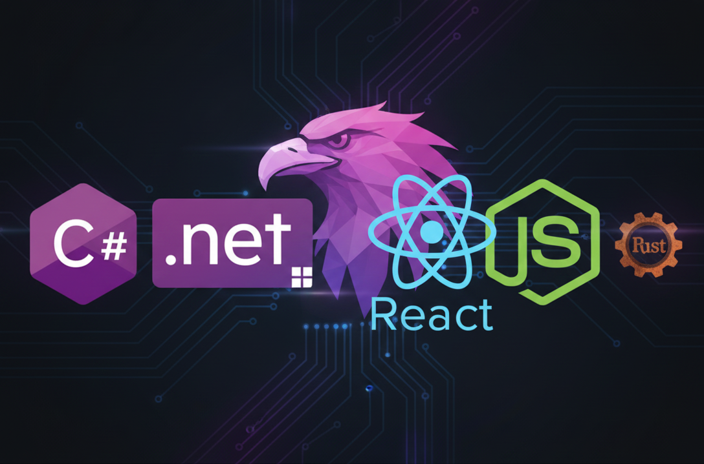

## Hey 👋, I'm Rich Mudway

I enjoy working in many areas and currently use with C#, Vite + React.js with TypeScript, Rust, Agentic AI and LLMs

- ✨ C# i like the newer stuff (.NET + Asp.Net Core) not the legacy stuff. This is because i like working on Linux.

- ❤️ Yes, yes, gently falling in love with Garuda Linux... shhh 🤫🙊 don't tell Ubuntu or Mint - they're still really really good friends

- 🌱 I’m currently learning Rust and AI (Agentic + MCP + LLMs)

- 🍳 I like to cook my code with Rider or VsCode
   - 🛠️ I do have a NeoVim setup, but went back to VsCode and just customised what i like over there... now i'm done... 

- 📫 How to reach me: Email or Social Network

- ⚡ Fun fact: I live in Thailand, but dont have a sun-tan ☀️

---

My AI just told me that frustrated Windows users have only 2 real options:
1. Throw computer out of the window
2. Throw Windows out of the computer

😡😡 Ok come---on-- 😭😭 👆🏻👆🏻 THAT was fun right ? 😇🤣 ==> Bad Ai... bad 🫵🏻 bad 🫵🏻, say nice things 🙏🏻🙏🏻

<!-- Here are some ideas to get you started:

- 🔭 I’m currently working on ...
- 🌱 I’m currently learning ...
- 👯 I’m looking to collaborate on ...
- 🤔 I’m looking for help with ...
- 💬 Ask me about ...
- 📫 How to reach me: ...
- 😄 Pronouns: ...
- ⚡ Fun fact: ... -->

